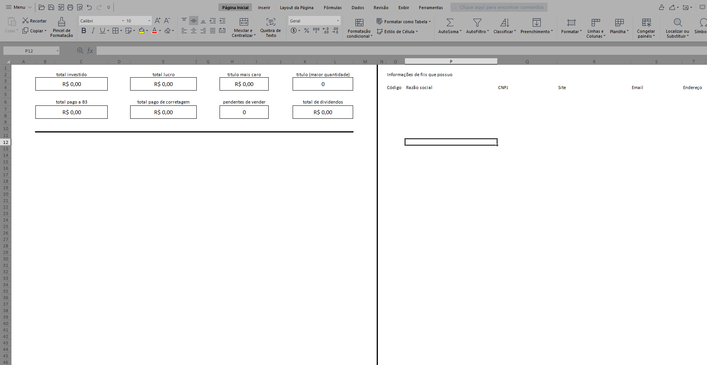
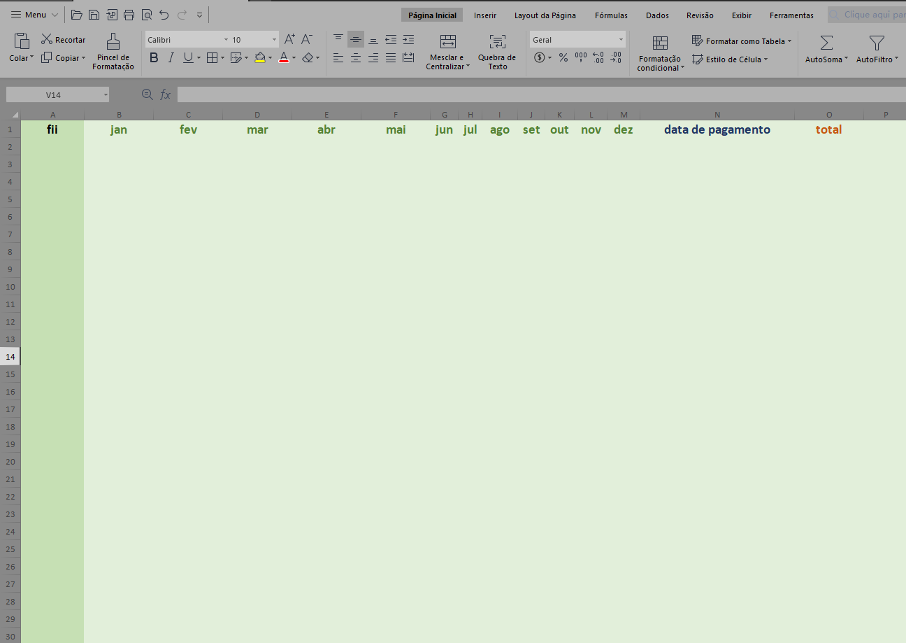

### Iwt-Invest-Control-Worksheet
    Planilha para controle de investimentos realizados na bolsa de valores.
    Com esta planilha você vai conseguir ter um controle de taxas, ganhos e perdas.

### Compatibilidade
[Libre Office 7.1 ou superior](https://pt-br.libreoffice.org/baixe-ja/libreoffice-novo/)

[Microsoft Office 2016 ou superior](https://www.microsoft.com/pt-br/microsoft-365/business/compare-all-microsoft-365-business-products-b?&ef_id=Cj0KCQiA7YyCBhD_ARIsALkj54plll_Z-V7XhXAFTGOI98c-wKXLtPAiZGVCU-HorjN-0faUoKlX2KEaAoyfEALw_wcB:G:s&OCID=AID2100139_SEM_Cj0KCQiA7YyCBhD_ARIsALkj54plll_Z-V7XhXAFTGOI98c-wKXLtPAiZGVCU-HorjN-0faUoKlX2KEaAoyfEALw_wcB:G:s&lnkd=Google_O365SMB_Brand&gclid=Cj0KCQiA7YyCBhD_ARIsALkj54plll_Z-V7XhXAFTGOI98c-wKXLtPAiZGVCU-HorjN-0faUoKlX2KEaAoyfEALw_wcB)

### Screenshots

### Gostou ?
Planilha desenvolvida por Tiago Henrique Iwamoto

Github: https://tiagoiwamoto.github.io

Linkedin: https://www.linkedin.com/in/tiago-iwamoto/

Gostou da planilha ? Poderia me pagar um café ?

[Via picpay R$ 5,00](https://picpay.me/tiagoiwamoto/5.0)

Via Pix: tiago.iwamoto@gmail.com
